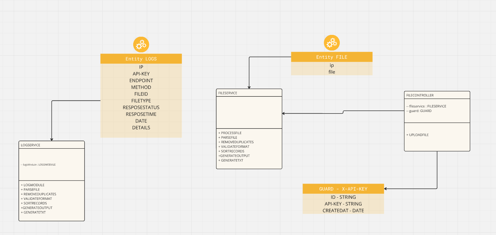
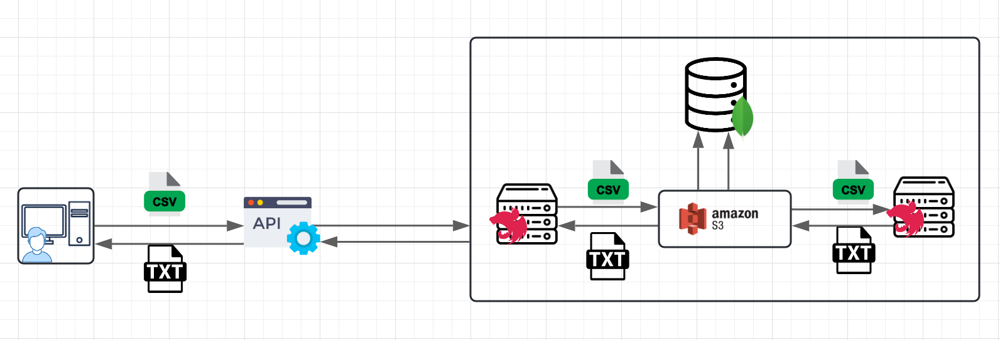

# Data Clean 

<p>
  Data Clean is an API that converts files primarily from .csv format to .txt. It should be noted that it is not only based on any file converter but also has specific validations regarding the data, with options that the user can activate to eliminate unwanted records or even to modify files within the files for reasons of convention. or unwanted repeated fields; This API has logs that manage a record throughout the application to manage requests and a history.
</p>

<p align="center">
  <a href="http://nestjs.com/" target="blank"></a>
  <a href="https://aws.amazon.com/es/s3/" target="blank"></a>
</p>

[circleci-image]: https://img.shields.io/circleci/build/github/nestjs/nest/master?token=abc123def456
[circleci-url]: https://circleci.com/gh/nestjs/nest

  <p align="center">A progressive <a href="http://nodejs.org" target="_blank">Node.js</a> framework for building efficient and scalable server-side applications.</p>
    <p align="center">
<a href="https://www.npmjs.com/~nestjscore" target="_blank"></a>
<a href="https://www.npmjs.com/~nestjscore" target="_blank"></a>
<a href="https://www.npmjs.com/~nestjscore" target="_blank"></a>
<a href="https://circleci.com/gh/nestjs/nest" target="_blank"></a>
<a href="https://coveralls.io/github/nestjs/nest?branch=master" target="_blank"></a>
<a href="https://discord.gg/G7Qnnhy" target="_blank"></a>
<a href="https://opencollective.com/nest#backer" target="_blank"></a>
<a href="https://opencollective.com/nest#sponsor" target="_blank"></a>
  <a href="https://paypal.me/kamilmysliwiec" target="_blank"></a>
    <a href="https://opencollective.com/nest#sponsor"  target="_blank"></a>
  <a href="https://twitter.com/nestframework" target="_blank"></a>
</p>
  <!--[](https://opencollective.com/nest#backer)
  [](https://opencollective.com/nest#sponsor)-->

## Description

[Nest](https://github.com/nestjs/nest) framework TypeScript starter repository.

## Installation

```bash
$ npm install
```

## Running the app

```bash
# development
$ npm run start

# watch mode
$ npm run start:dev

# production mode
$ npm run start:prod
```

## Test

```bash
# unit tests
$ npm run test

# e2e tests
$ npm run test:e2e

# test coverage
$ npm run test:cov
```

## Documentation

<p>
This APP has good documentation and is well grouped. Swagger is used for the code and the documentation for the entire project is found in confluence.
</p>

<p align="center">
  <a href="https://cardonadeiby88.atlassian.net/wiki/x/RQHS" target="blank"></a>
  <a href="http://nestjs.com/" target="blank"></a>
</p>

# Diagrams

<p>This is UML diagram</p>
  <p align="center">
  <a href="https://cardonadeiby88.atlassian.net/wiki/x/RQHS" target="blank"></a>
</p>
<p>This is architecture diagram</p>
  <p align="center">
  <a href="https://cardonadeiby88.atlassian.net/wiki/x/RQHS" target="blank"></a>
</p>

# Architecture pattern

The architectural pattern that was used was planned by the entire team according to the understanding of the HU, an easy and fluid way was chosen, the option to use AWS S3 was taken by the development team due to previous experiences in other projects and by the documentation and usefulness of each of the two tools.

## development team

- <a href="https://github.com/AXrodriguezQ" target="blank">AXrodriguezQ</a>
- <a href="https://github.com/cristianManco" target="blank">AXrodriguezQ</a>
- <a href="https://github.com/deiby666" target="blank">deiby666</a>
- <a href="https://github.com/holas1356" target="blank">holas1356</a>

## Support

Nest is an MIT-licensed open source project. It can grow thanks to the sponsors and support by the amazing backers. If you'd like to join them, please [read more here](https://docs.nestjs.com/support).

## Stay in touch

- Author - [Kamil Myśliwiec](https://kamilmysliwiec.com)
- Website - [https://nestjs.com](https://nestjs.com/)
- Twitter - [@nestframework](https://twitter.com/nestframework)

## License

Nest is [MIT licensed](LICENSE).
